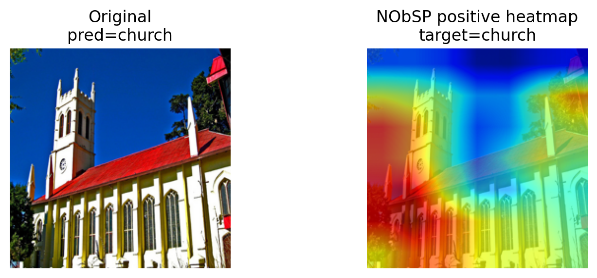

# nobsp_lib

`nobsp_lib` is the self-contained NObSP library for tabular and vision interpretability.



*Temporary NObSP-CAM example figure. This will be replaced later.*

NObSP stands for Nonlinear Oblique Subspace Projections. The method decomposes a neural network prediction into interpretable feature-wise contributions. Instead of returning only scalar importances, NObSP recovers functional components that describe how each variable contributes to the prediction across its range.

## Method Overview

The key idea behind NObSP is architectural. In a trained neural network, the nonlinear part of the computation is the mapping from the input to the penultimate representation `z`. The final layer is linear. This makes the decomposition problem tractable in the penultimate representation space.

For each input feature, NObSP builds a subspace associated with the network response when only that feature is active. The prediction can then be decomposed through oblique projections:

- orthogonal projection is not enough when learned feature subspaces overlap
- oblique projection isolates the part of the representation uniquely attributable to one feature while accounting for the others
- this lets NObSP handle correlated inputs and representation overlap in a principled way

In tabular problems, NObSP yields contribution functions `g_k(x_k)` for each variable. These functions can be studied locally on individual samples and globally across the dataset.

In vision problems, the same idea leads to NObSP-CAM. After calibration, channel coefficients are combined with spatial feature maps to produce class activation maps. By default, `nobsp_lib` uses the positive NObSP-CAM as the main heatmap, following the same positive-evidence convention used for the paper comparisons with GradCAM-style methods.

## What The Library Supports

### Tabular

- regression and classification
- `basic`, `alpha`, and `beta` decomposition methods
- arbitrary PyTorch models through a tabular adapter layer
- optional preprocessing transforms
- fitted explanation save/load

### Vision

- `alpha` and `beta` NObSP-CAM
- calibration from a dataloader
- configurable `target_layer`
- configurable `flatten_strategy` and `decomposition_space`
- positive, negative, and mixed CAM views
- calibrated coefficient save/load

## Install

`nobsp_lib` now vendors the required NObSP runtime, so it installs as a single package.

### Editable Install

```bash
cd nobsp_lib
pip install -e .
```

### Wheel Install

```bash
cd nobsp_lib
pip install .
```

No separate `nobsp` install is required.

## Quick Start

### Tabular Example

```python
import torch
from sklearn.preprocessing import StandardScaler

from nobsp_lib import TabularExplainer

model = torch.nn.Sequential(
    torch.nn.Linear(6, 64),
    torch.nn.ReLU(),
    torch.nn.Linear(64, 32),
    torch.nn.ReLU(),
    torch.nn.Linear(32, 1),
)

scaler = StandardScaler().fit(X_train)

explainer = TabularExplainer(task="regression", method="alpha")
explainer.fit(
    model=model,
    X=X_train,
    feature_names=feature_names,
    transform=scaler.transform,
)

predictions = explainer.predict(X_test)
contributions = explainer.explain(X_test)
importance = explainer.feature_importance()
```

For classification, set `task="classification"`. By default, the explainer hooks the input to the last `nn.Linear` layer, which makes it usable with standard PyTorch tabular models. You can override that with `feature_layer=...` when needed.

If you want a quick built-in trainer for demos or notebooks:

```python
from nobsp_lib import EasyTabularExplainer

easy = EasyTabularExplainer(
    task="classification",
    method="beta",
    epochs=100,
)
easy.fit(X_train, y_train, feature_names=feature_names)
```

### Vision Example

```python
from nobsp_lib import VisionExplainer

cam = VisionExplainer(
    method="beta",
    target_layer="layer4",
    flatten_strategy="channel",
    decomposition_space="classifier_input",
)

cam.fit(
    model=model,
    calibration_loader=loader,
    max_samples=128,
)

results = cam.explain(images)
positive_heatmap = results[0]["heatmap"]
negative_heatmap = results[0]["heatmap_negative"]
mixed_heatmap = results[0]["heatmap_mixed"]
```

The default `results[i]["heatmap"]` is the positive CAM. If you want the other views explicitly:

```python
positive = cam.explain_positive(images)
negative = cam.explain_negative(images)
mixed = cam.explain_mixed(images)
```

Or select the mode at call time:

```python
results = cam.explain(images, heatmap_mode="mixed")
```

The one-step calibration and explanation flow is also available:

```python
results = cam.fit_transform(
    model=model,
    calibration_loader=loader,
    images=images,
    max_samples=128,
)
```

After calibration, the explainer exposes the main fitted attributes:

- `coefficients_`
- `n_classes_`
- `selected_classes_`
- `calibration_targets_`

## Plotting Helpers

The library includes lightweight plotting utilities:

- `plot_training_history`
- `plot_tabular_feature_curves`
- `plot_importance_heatmap`
- `plot_vision_gallery`
- `plot_vision_split_gallery`
- `select_vision_heatmap`
- `overlay_heatmap`

Typical vision usage:

```python
from nobsp_lib import plot_vision_gallery, plot_vision_split_gallery

plot_vision_gallery(images, results, class_names=class_names)
plot_vision_split_gallery(images, results, class_names=class_names)
```

`plot_vision_gallery(...)` uses the positive CAM by default. `plot_vision_split_gallery(...)` renders positive and negative evidence side by side.

## Public Objects

### Main Classes

- `TabularExplainer`
- `EasyTabularExplainer`
- `VisionExplainer`
- `EasyVisionExplainer`

### Utilities

- `SmallConvNet`
- `plot_training_history`
- `plot_tabular_feature_curves`
- `plot_importance_heatmap`
- `plot_vision_gallery`
- `plot_vision_split_gallery`
- `select_vision_heatmap`
- `overlay_heatmap`

## Examples

Run the included examples:

```bash
python examples/tabular_regression_curves.py
python examples/vision_shapes_heatmaps.py
```

Outputs are written under `outputs/`.

## Citation

If you use `nobsp_lib`, please cite the NObSP paper.

Provisional reference:

- Alexander Caicedo et al. *NObSP: Functional Decomposition of Neural Networks via Oblique Subspace Projections*. Manuscript in preparation.

Provisional BibTeX:

```bibtex
@misc{caicedo2026nobsp,
  author = {Alexander Caicedo, Victor de la Hoz, and Santiago Alférez},
  title = {NObSP: Functional Decomposition of Neural Networks via Oblique Subspace Projections},
  year = {2026},
  note = {Manuscript in preparation}
}
```
